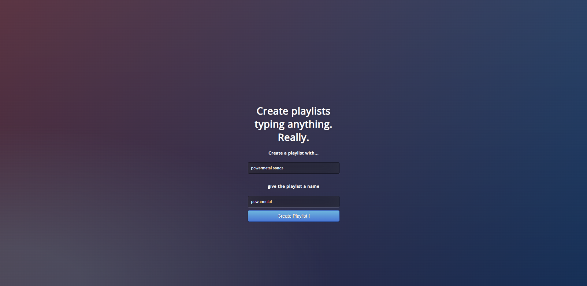
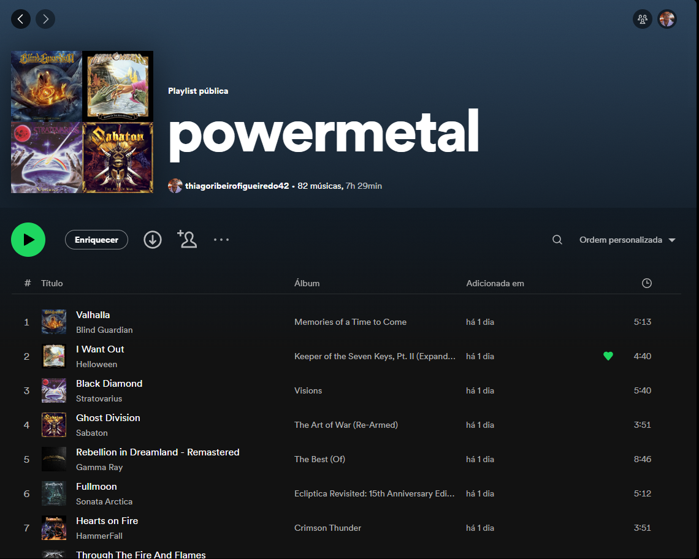
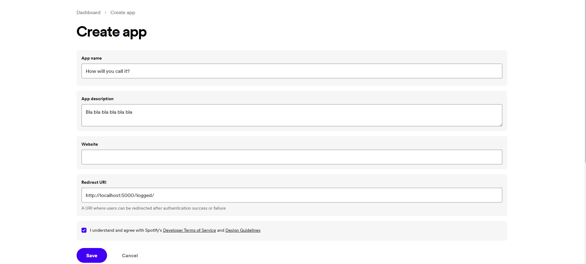
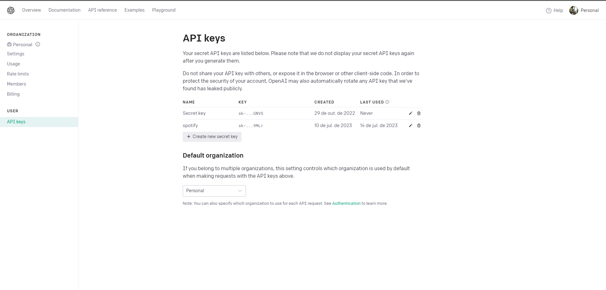

<h3>This script has a simple, but useful function: take the user's prompt (command, so to speak) and create a playlist with songs considering the prompt, automatically adding it to the user's Spotify account.</h3>
  

<i>This is how the page looks like:</i>

<i>And this is the generated playlist:</i>

  

<h1>Getting Started</h1>

I won't go through all of the code nor explanation. But there are some important steps to take before running the script. Those are:

<ul>
<li><h2>Getting Spotify API  Credentials</h3></li>
In order to use Spotify API, you'll need to create an app (a service). First, access https://developer.spotify.com/. Then, hit the "Create app" button. You'll get to the following screen:

The 'Redirect URI' whitelists a valid link. In our case, it will redirect to the page where we get some access info, as the oauth object and the token returned from spotify.

<li><h2>Getting Chat GPT API Credentials</h3></li>

Chat GPT API follows the same logic as Spotify. You'll need a chatgpt/openai account in order to create a new secret key. Check https://platform.openai.com/account/api-keys.
It's important to notice, though, that chatgpt API is a paid feature: it's pricing is listed in https://openai.com/pricing.
For new users, there is a free credit period. Anyways, the secret key page looks like this: 

Both Spotify and Chat GPT keys (in the case of Spotify, secret key is also used) are used in the project and must not be shared.
Check the comments on the code to confirm where the keys should be placed.

<li><h2>Other info</h3></li>
It's important to say that this project is inspired by Jason Goodinson's idea on creating a script to convert Spotify songs to YouTube and download them.
Since this project has the main goal of serving as a study practice, some parts of the code are similar to Jason Goodinson's videos/tutorials.
You can watch the video in https://www.youtube.com/watch?v=g6IAGvBZDkE. He also gives a direct explanation on Oauth, an important concept regarding client-api communication.

Feel free to help with a pull request.
See ya.

<h4><b>Thiago Ribeiro.</b></h4>

</ul>
